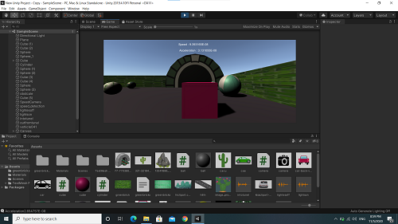
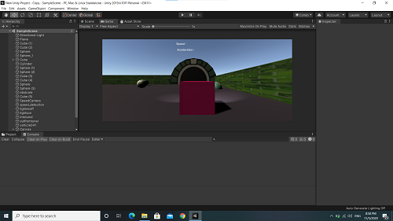
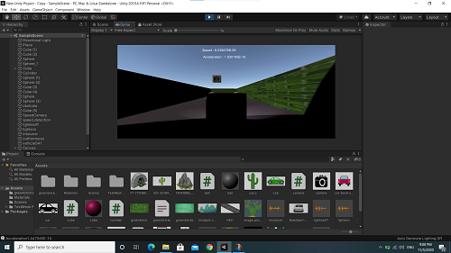
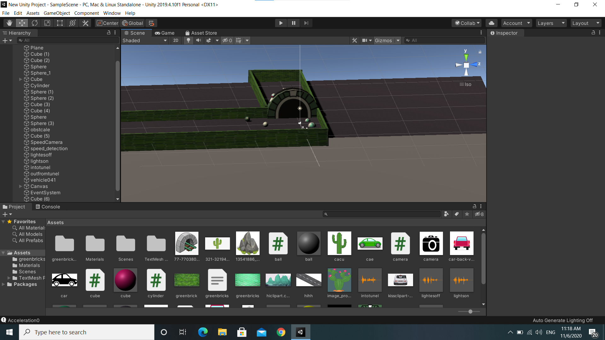

# Simple Car

The repository contains a very simple car game with the following conditions:

1) The car is a rectangular cube.

2) The car can move forward, reversing and changing the angle.

3) Using a flat cube as a ground and placing several cubes with appropriate scales on the edges of the ground and an area. Depending on the car, design the car to move within a certain range and collide with the cubes.

4) Set a few spheres or different objects on the ground that the car will hit or move.

5) Used a rigid body for the car and the physics and collision detection.

6) In front of the car cube, there are 2 lights that are off in the pre-populated position. But by pressing the P button, the lights turn on + a beep sound is played.
The P button turns off the lights and mutes the beep when it is released.

7) The wheelbase is connected to the car and behind the car (like most car games)

Create a tunnel in the game, and when the car enters it, the car light will automatically turn on, and when the car leaves it, the light will go off.

## Language
The project is written in C#(Unity).

## Images
</img> 
</img> 
</img> 
</img> 
## Contributing
Pull requests are welcome. For major changes, please open an issue first to discuss what you would like to change.

Please make sure to update tests as appropriate.

## License
[ Apache-2.0 License](http://www.apache.org/licenses/)

